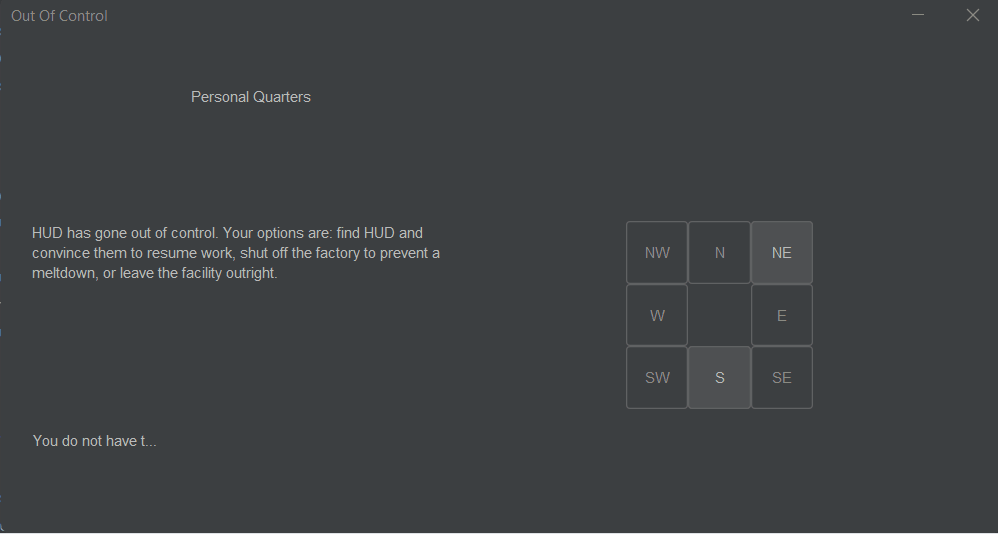
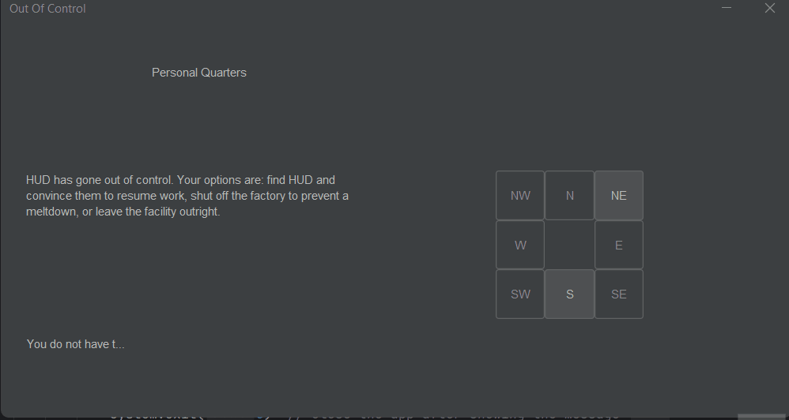
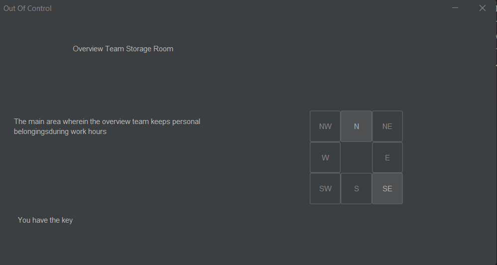
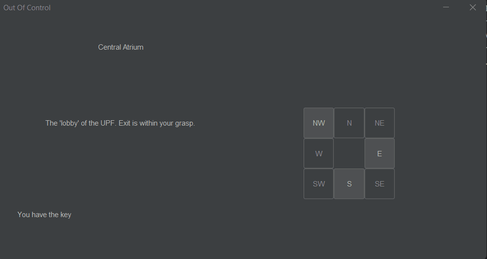

# Results of Testing

The test results show the actual outcome of the testing, following the [Test Plan](test-plan.md)

---

## Testing Key Functionality

This test checks whether the key system works as intended.
The player should not be able to access certain rooms
without the key, can only collect the key from the
correct room, and should be able to access restricted
rooms ("Factory Settings", "Exit") and pathways
("Travel Destination" from "Travel Point") after collecting the key.

### Test Data Used

In GIF 1: moved from "Personal Quarters" to "Overview Team Storage Room"
through "Hallway 2AF". This is the standard and only way to obtain the
key. Upon obtaining the key and leaving the room, the GUI is updated to show
"You have the key", and the "Factory Settings" room can be entered.

In GIF 2: In a new game, moved directly to "Travel Point" and attempted to
move to "Travel Destination" several times, with no success. The UI did not
update and the game did not crash. This also happened with moving to
"Factory Settings" and "Exit".

### Test Result

hasKey has been set as true after entering "Overview Team Storage Room"
and the intended win rooms cannot be entered without the key.

This reaffirms that the intended rooms and
pathways cannot be entered without the key.
---

## Testing Win Conditions and Win Screen

This test verifies that when the player reaches a winning room
(such as "Exit" or "HUD"), the game correctly triggers the win condition
and shows the "You win!" screen after a 3-second delay. It also
checks that the game exits after the win message is shown.

### Test Data Used

GIF 1: testing that the ending works when entering the "HUD" room.

GIF 2: testing that the ending works when entering the "Exit" room.

### Test Result

It works. Upon entering the HUD room, there is a 3~ second delay before a modal
popup window with the text "You win!" appears. After closing the modal popup,
the game closes.

It works. Upon entering the Exit room, there is a 3~ second delay before a modal
popup window with the text "You win!" appears. After closing the modal popup,
the game closes.

---

